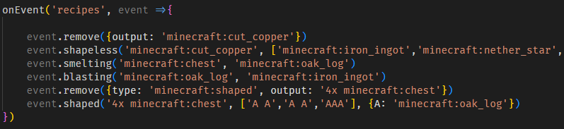
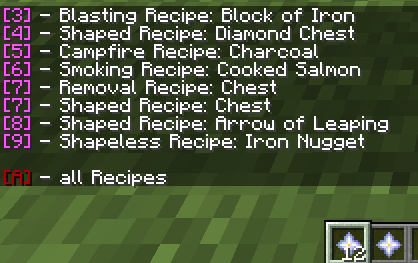

# Craft.js
KubeJS Helper Script - a Craft.zs Equivelant

## Description

Craft.js is a KubeJS script, which allows you to prepare recipes inside a Container (like Chests) to quickly create various recipes.

## Prerequisites

- **KubeJS 5**

## Instalation

Copy the Craft.js into your instances `./kubejs/server_scripts/` and run `/reload` ingame.

## Functionality / Usage

Recipes are build inside a 4x3 Grid inside your Container.

The 3x3 Grid on the left is your input grid
the 3 slots on the right are for:
- Modifier
- Output
- Removal

**Modifier** currently supports:

- Shaped       (`air`)
- Shapeless    (`minecraft:glass_pane`)
- Smelting     (`minecraft:furnace`)
- Blasting     (`minecraft:blast_furnace`)
- Smoking      (`minecraft:smoker`)
- Campfire     (`minecraft:camp_fire`)
- Stonecutting (`minecraft:stonecutter`)

**Removal** currently supports:

- Remove all recipes with output         (`minecraft:lava_bucket`)
- Remove all Recipes with output/type    (`minecraft:iron_nugget`)
Removal Items are easily changable in the Script

After you have laid out your Recipes, crouch and right click your Container with your triggerItem (default: `minecraft:nether_star`)

Here, you can click every [#], to copy a single Recipe, or click the [A] to copy all recipes

Afterwards, paste them in your RecipeEvent.

## Additional Information

This Script works with Modded Containers aswell, such as IronChest and even ColossalChests.
ColossalChests works on both the Core and the Interface

If the Container has a bigger Width, you need to hold n-amount of triggerItems in your hand

## Big Thanks to:
- Latvian.dev Discord
- ChiefArug
- Lexxie
- DerCommander
- Alp
